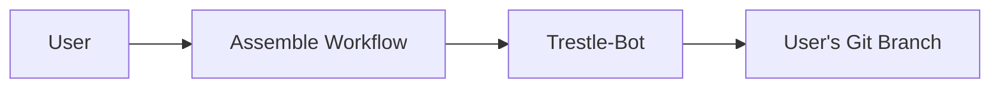
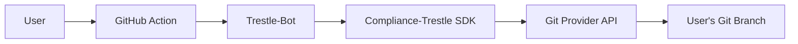

# Assemble Diagrams

## Context

```mermaid
graph LR
    User["User"] --> Assemble_Workflow["Assemble Workflow"]
    Assemble_Workflow --> Trestle_Bot["Trestle-Bot"]
    Trestle_Bot --> Branch["User's Git Branch"]
```

## Container

```mermaid
graph LR
    User["User"] --> GH_Action["GitHub Action"]
    GH_Action --> Trestle_Bot["Trestle-Bot"]
    Trestle_Bot --> Compliance_Trestle["Compliance-Trestle SDK"]
    Compliance_Trestle --> Git_Provider_API["Git Provider API"]
    Git_Provider_API --> Branch["User's Git Branch"]
```

## Component

## Code